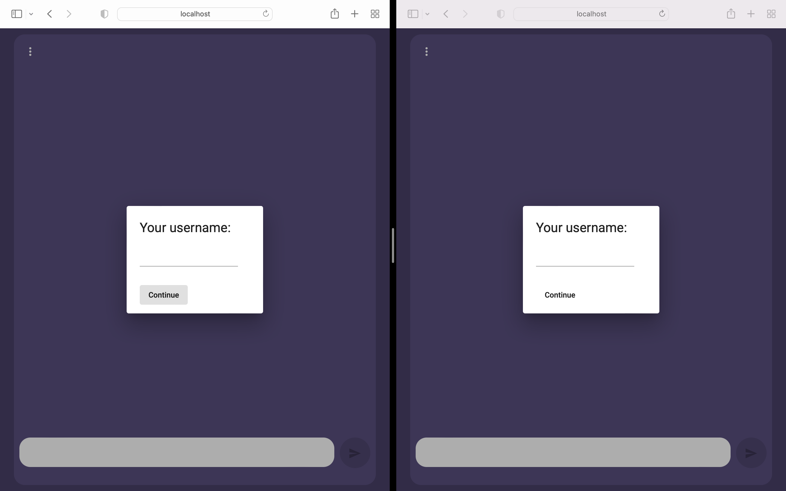
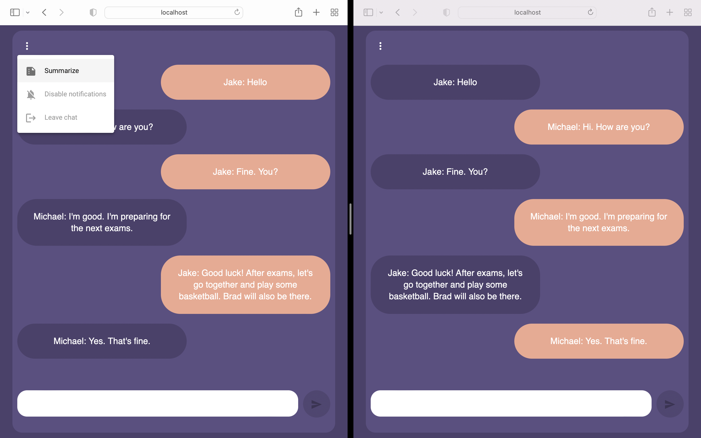
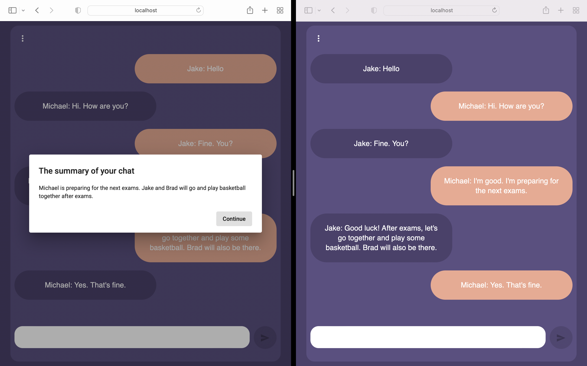

# Chat summarizer 📝

> Disclaimer! This is a prototype and a fun project that I've been working on and it is not ready for production. It was done in a few days to experiment and play with new technologies for me.

## Introduction

*Sometimes you need to share a chat with a friend, maybe to gossip a little bit, maybe just laugh at what others write to you or you want to share a 2-page long explanation from your divorced wife why you are the worst human being. Probably you will start copying text from your WhatsUp or Telegram account or maybe you will do some screenshots and then you will send it to your bestfriend. *

*But this approach is not sustainable and it is very time-consuming. Your friend must be up-to-date with your personal life latest news. It is possible to invoke Feodor Dostoevsky or Mark Twain to narrate in 3-4 sentences your stupid, non-sense conversation? Well, the answer is YES. What you need is just an emotionless and rigorous AI model that will interpret your chat log and will summarize from a third-person perspective the entire conversation.*

## What AI?

That emotionless but rigorous AI that I've been mentioned earlier is just a awesome Python library called HuggingFace 🤗 Transformers that helps engineers to build better Machine Learning solutions by using state-of-the-art models. The advantage of this library over other libraries/frameworks are the following:
 - Provides thousands of pre-trained models to perform different tasks like text classification, text generation, object detection & segmentation, and even audio tasks like speech recognition.
 - Easy to use since it provides a low barrier to entry for practitioners
 - Backed by TensorFlow, PyTorch, or JAX.
 - Did I mention a simple API called `pipeline` that even a simple developer can use without knowing any math or statistics? 

## A brief demonstration

### *1) User enter his name*

### *2) The chat conversation is happening and the user requests summarization*

### *3) The output of the summarization appears on thre screen*

## The model 

To perform the summarization task I used a pretrained model called [lidiya/bart-large-xsum-samsum](https://huggingface.co/lidiya/bart-large-xsum-samsum) which is based on Facebook's BART large CNN model and it was trained on 16K chat logs dataset called [samsun](https://huggingface.co/datasets/samsum)

